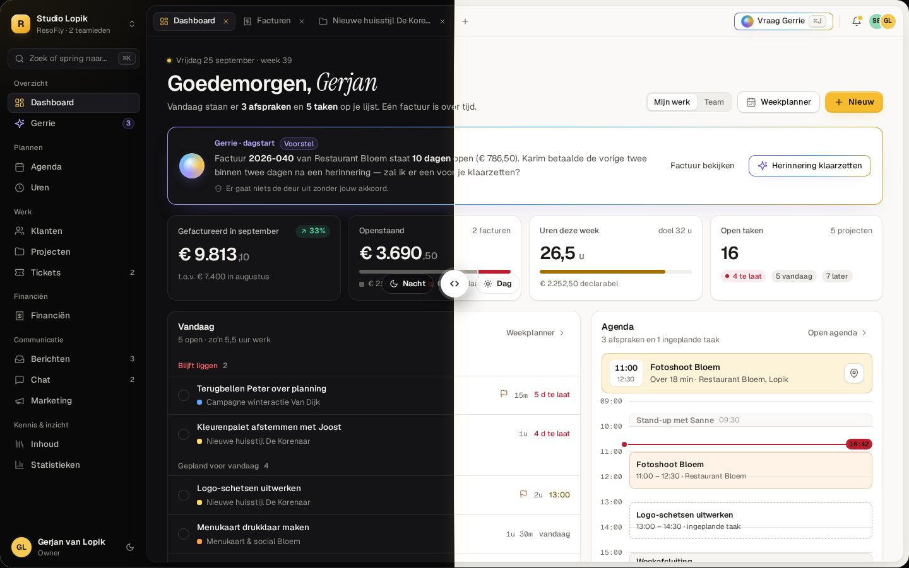
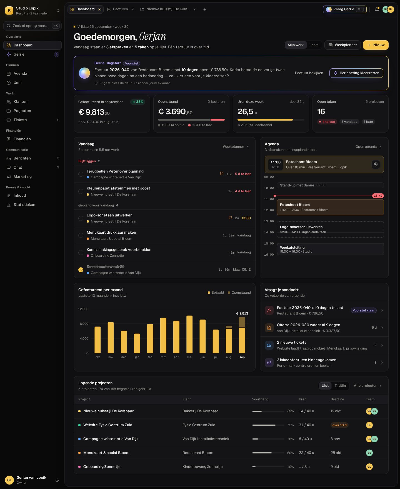
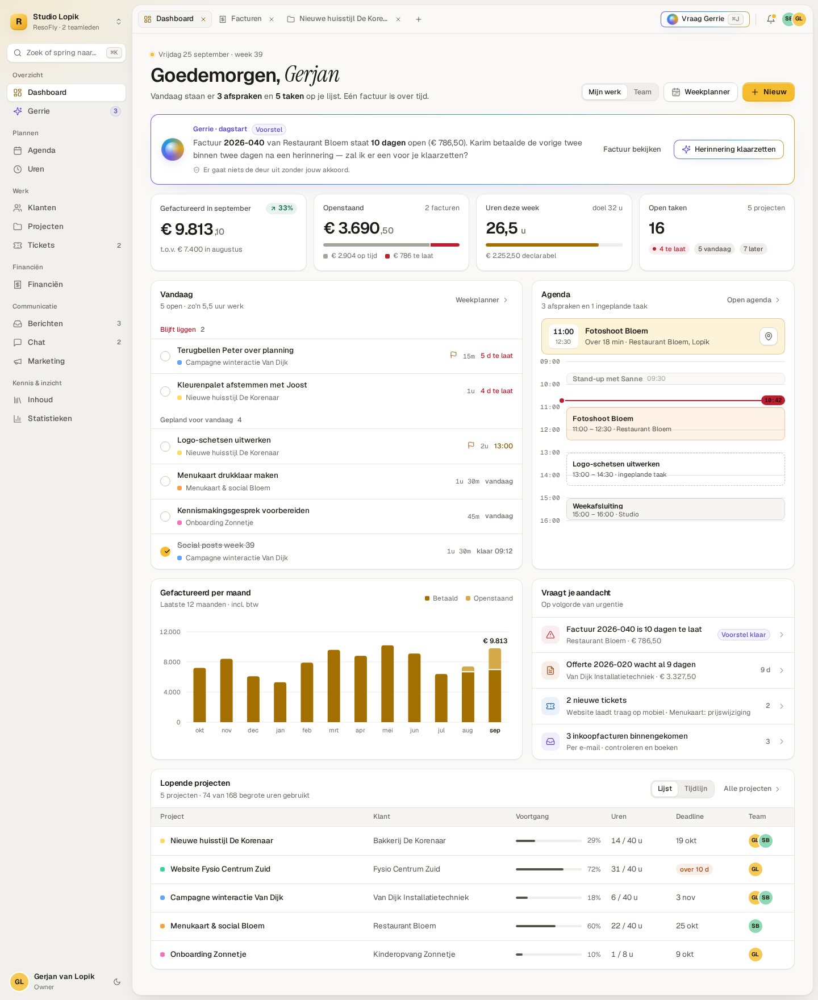
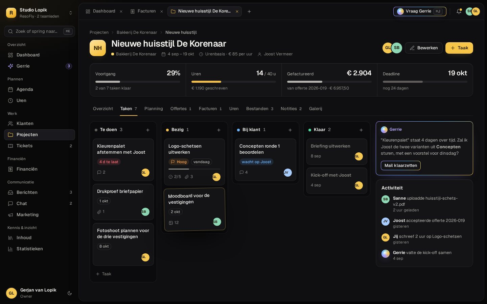
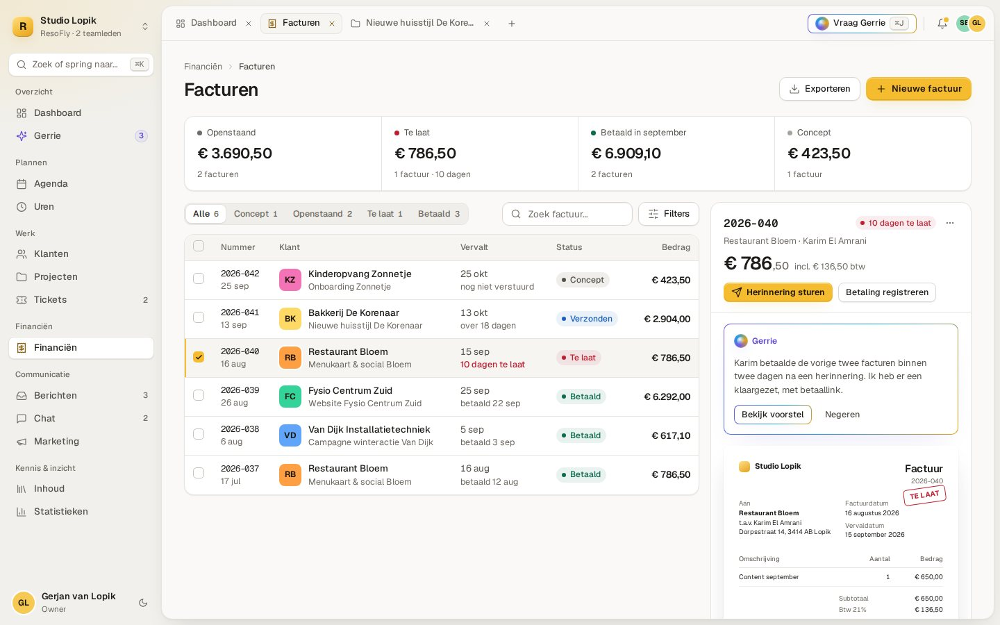
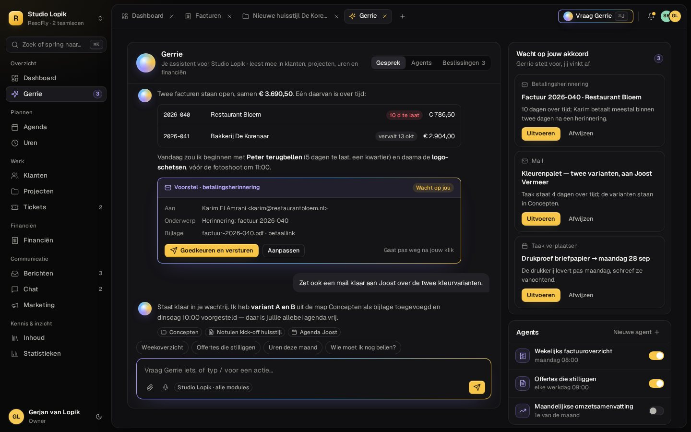
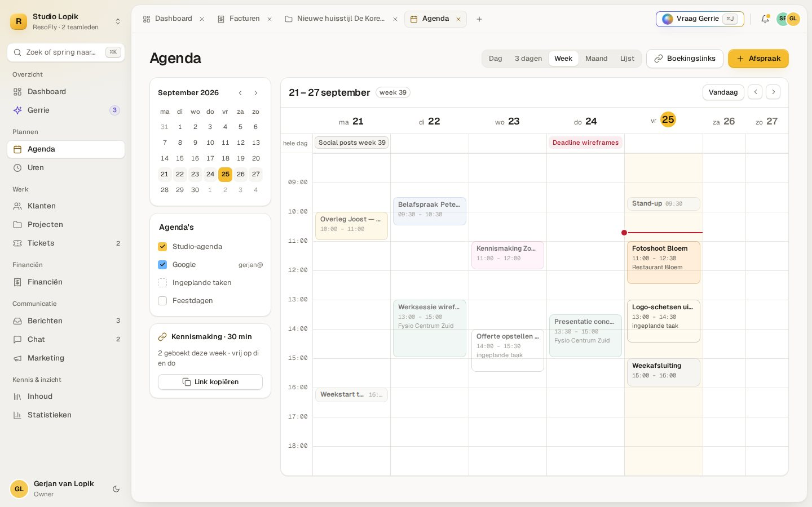
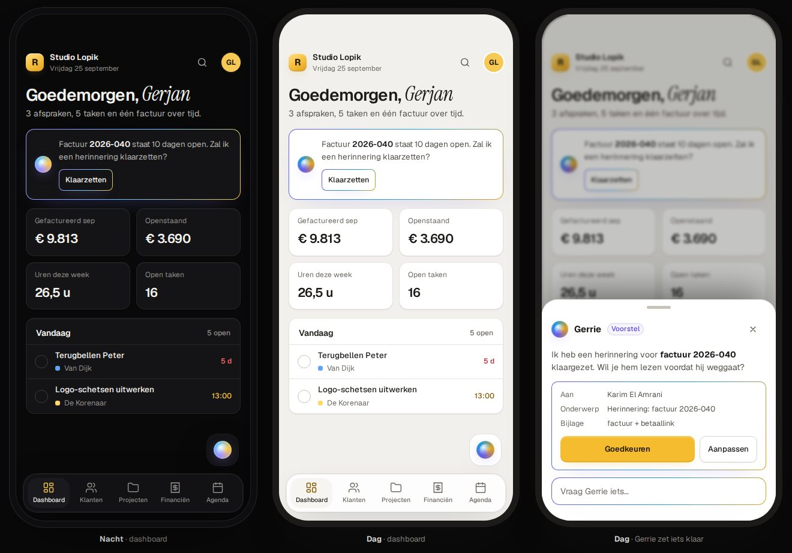

# Designvoorstel — ResoFly Belicht — 2026-09-25

Een nieuwe look & feel voor de hele werkruimte, ontworpen voor **Nacht** (donker) én **Dag**
(licht). Dit is een voorstel: er is in deze branch **geen app-code gewijzigd**. Alles staat in
`docs/design-voorstel-belicht/` en is los in een browser te openen.

> *Eén systeem, twee lichten.* Nacht is een studio in de avond met één warme lamp (het goud);
> Dag is dezelfde studio bij daglicht: papierwit op warm steen, haarlijnen in plaats van gloed.

## Bekijken

| wat | waar |
|---|---|
| Interactief voorstel: vergelijkschuif Nacht/Dag, klikbaar prototype (5 schermen, ⌘K, Gerrie), kleuren met live contrastberekening, componenten, mobiel en invoerplan | `docs/design-voorstel-belicht/index.html` — dubbelklikken, of `npx serve docs/design-voorstel-belicht` |
| Alle tokens en componenten als CSS | `docs/design-voorstel-belicht/belicht.css` |
| Designcanvas met elk scherm als artboard, Nacht en Dag naast elkaar (reageren per scherm kan daar) | https://claude.ai/artifact/K5C3oMXzXDE4hSEicMNDae — privé; deel het via het Share-menu |

De schermen gebruiken de voorbeeldgegevens uit de testomgeving (`tests/mobile/mock/seed.mjs`):
Studio Lopik, Bakkerij De Korenaar, Restaurant Bloem, factuur 2026-040, enzovoort.

| Nacht | Dag |
|---|---|
|  |  |
|  |  |
|  |  |

## Wat er verandert (gemeten aan de werkruimte nu, desktop 1440 × 900)

| | nu | Belicht |
|---|---|---|
| Balken bovenin | 114 px: werktabs plus een aparte titelbalk | 50 px: werktabs, *Vraag Gerrie* en meldingen in één regel; de titel staat in de pagina |
| Kerncijfers dashboard | zes kaarten; bedragen vallen weg (*€ 3.690,5…*) | vier kaarten met context (meter, vergelijking), bedragen altijd voluit |
| Letter | Poppins, veel kapitalen met spatiëring | Geist voor alles, Instrument Serif voor één accent per scherm, Geist Mono voor nummers en tijden |
| Goud | op labels, iconen, randen, gloed én knoppen | alleen hoofdactie, focus en de plek waar je bent |
| Gerrie | hetzelfde goud als de rest | een eigen laag, het **poollicht** (violet → blauw → goud) |
| Vlakken | kaarten met gloed en schaduwwolken, raster op de achtergrond | één werkpaneel op de grond, haarlijnen, licht dat van boven valt |
| Menu | regels van 44 px, een organisatiekaart bovenin | regels van 32 px, een compacte werkruimtekiezer en ⌘K |

## Zes principes

1. **Rust boven ruis** — geen hoofdletters met spatiëring, geen kaart-in-kaart, één haarlijn waar er drie stonden.
2. **Goud betekent iets** — zongoud is de hoofdactie, de focus en de plek waar je bent. Nergens anders.
3. **Cijfers kloppen altijd** — tabelcijfers in kolommen, bedragen nooit afgekapt, centen een tikje kleiner.
4. **Gerrie is herkenbaar** — alles wat de assistent maakt of voorstelt draagt het poollicht; niets gaat weg zonder jouw klik.
5. **Twee lichten, één systeem** — Nacht en Dag zijn allebei ontworpen, niet omgekeerd.
6. **Alles binnen twee toetsen** — één opdrachtpalet (⌘K) voor zoeken, springen, maken en Gerrie iets vragen.

## Tokens

Elke teksttoken haalt WCAG AA (≥ 4,5:1) op een kaart, in beide thema's. De voorstelpagina rekent
dat zelf na op de kleuren die je ziet. De twee grafiektinten zijn als geordend paar gevalideerd
(één tint, zichtbare stap, ≥ 2:1 voor de lichte stap).

| token | Nacht | Dag | wordt in `globals.css` |
|---|---|---|---|
| grond | `#09090A` | `#F1F0EC` | `--bg-deep` |
| werkpaneel | `#0F0F11` | `#FAF9F7` | `--bg` |
| kaart | `#141417` | `#FFFFFF` | `--surface` |
| verhoogd / ingedrukt | `#1A1A1E` / `#212126` | `#F6F5F2` / `#EFEEEA` | `--surface-2` / `--surface-3` |
| lijnen | wit 7,5% / 11% | `#E7E5E0` / `#DAD7D0` | `--line` / `--line-2` |
| inkt 1 · 2 · 3 | `#F4F3F0` · `#B5B3AD` · `#908E88` (16,6 · 8,8 · 5,6) | `#1C1B18` · `#55524B` · `#6F6B63` (17,2 · 7,8 · 5,3) | `--ink` · `--ink-2` · `--ink-3` |
| zongoud (vulling) | `#F7C548` | `#F4BC2E` | `--accent` |
| goud als tekst | `#F7C548` (11,4) | `#855800` (6,2) | `--accent-ink` |
| tekst op goud | `#1A1405` (11,4) | `#1C1405` (10,5) | `--on-accent` |
| gelukt · let op · te laat · info | `#4CD9A0` · `#FFA24C` · `#FF6B72` · `#6CB6FF` | `#0B6B4E` · `#A3470A` · `#BD1F31` · `#1A5FBA` | `--ok` · `--warn` · `--danger` · `--info` |
| poollicht (Gerrie) | `#A392FF` → `#6CC4FF` → `#F7C548` | `#6E5AE6` → `#1F9BE0` → `#E0A11B` | nieuw: `--ai-1..3` |
| grafiek betaald / openstaand | `#F2BE45` / `#7A6230` | `#A36F00` / `#D4AA48` | nieuw: `--viz-1` / `--viz-2` |

**Vorm:** hoeken 6 · 8 · 10 · 14 · 18 · 22 px, binnen elkaar concentrisch. **Diepte:** op Nacht een
glansrand van boven (`inset 0 1px 0`), op Dag een zachte schaduw. **Beweging:** 120 ms (hover,
vinkjes), 200 ms met veer (menu's, schakelaars), 320 ms (panelen, Gerrie); alles uit bij
*reduced motion*.

## Letter

- **Geist** — alle bediening en tekst. Tabelcijfers (`tnum`) waar bedragen onder elkaar staan;
  proportionele cijfers voor losse kerncijfers.
- **Instrument Serif, cursief** — één accent per scherm: je naam in de groet, een lege staat. Nooit voor cijfers.
- **Geist Mono** — factuurnummers, tijden, schattingen, sneltoetsen.

Alle drie komen van Google Fonts, net als Poppins nu.

## Invoeren in vier stappen

De werkruimte heeft al een tokenlaag in drie lagen (kanalen → semantiek → compat, zie het
THEMA-TOKENS-blok in `src/styles/globals.css`). Daardoor kan Belicht binnenkomen zonder dat er één
scherm tegelijk stuk hoeft:

1. **Fundament** — de tokens hierboven in het THEMA-TOKENS-blok, plus de drie lettertypen in
   `index.html`. Via de compat-laag volgt vrijwel elk scherm direct.
2. **Werkruimte** — zijbalk, werkpaneel en één balk voor werktabs, Gerrie en meldingen; ⌘K.
3. **Schermen** — eerst dashboard, agenda, projecten, facturen en Gerrie; daarna module voor module.
4. **Buitenkant** — publieke offerte- en factuurpagina's, klantportaal (met de eigen klantbranding
   uit `brandThemeVars`), e-mails en pdf's.

Veilig invoeren kan achter een schakelaar per gebruiker (*Probeer de nieuwe look*), naast het
huidige ontwerp. `npm run test:mobile -- --theme=both` meet dan beide thema's; een contrastcheck
in de CI bewaakt dat elke tekstkleur AA blijft halen.

## Niet gewijzigd

- Geen app-code, geen database, geen Edge Functions: alleen `docs/design-voorstel-belicht/` en dit document.
- Het huidige ontwerp blijft precies zoals het is tot er voor stap 1 gekozen wordt.
