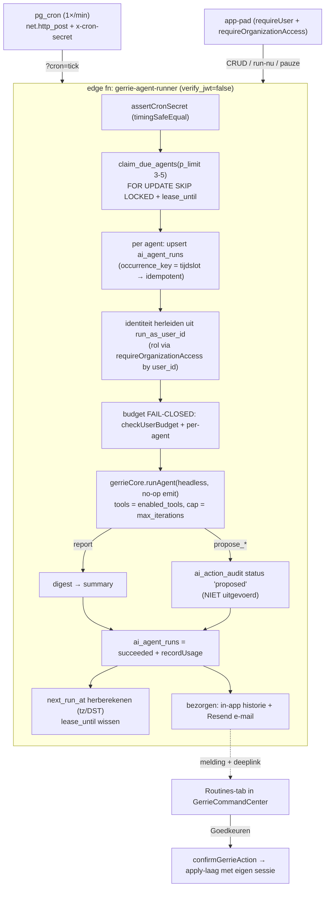

# Gerrie Routines — bouwplan (gebruikers bouwen eigen geplande agents)

> **Status:** ontwerp goedgekeurd, nog niets gebouwd. Datum: 2026-07-15.
> **Twee vastgelegde keuzes van de PO:**
> 1. **Vervolg:** eerst dit volledige bouwplan; groen licht per fase.
> 2. **Autonomie:** **v1 = altijd jouw goedkeuring** voor elke schrijfactie. Géén onbewaakte mutaties. De kolom om later te automatiseren bouwen we wél alvast mee, maar staat server-side dichtgezet.

---

## 1. Doel & scope

Gebruikers bouwen binnen Gerrie zelf **terugkerende agents** ("Routines") zonder code of cron-syntax. Voorbeelden van de PO:

- *"Elke maandag 08:00 — geef me openstaande facturen ouder dan 30 dagen."* → **report-agent** (alleen lezen, volledig autonoom).
- *"Elke week — stuur betalingsherinneringen."* → **propose-agent** (stelt voor, jij keurt met één klik goed).

**In v1 (Fase 0 + 1):**
- Twee autonomie-modi: `report` (read-only, autonoom) en `propose` (voorstel → bestaande goedkeuringswachtrij).
- Presets voor het schema: dagelijks / wekelijks / maandelijks + uur, in tijdzone `Europe/Amsterdam`.
- Bezorging: in-app run-historie + optionele e-mail (Resend).
- Aanmaken: alleen `owner`/`admin`.

**Expliciet NIET in v1:**
- Geen onbewaakte schrijfacties (geen auto-verzenden/auto-aanmaken).
- Geen vrije cron/RRULE-schema's.
- Geen OS-push (komt Fase 2 — raakt drie enum-plekken, zie risico's).
- Geen multi-step "Commandocentrum"-decompositie per run.

---

## 2. Kernprincipe: de veiligheidsinvariant blijft intact

Gerrie voert vandaag **nooit** server-side schrijfacties uit. Een `propose_*`-tool bouwt alleen een gevalideerd `Proposal`; de browser voert het uit met de **eigen RLS-sessie** van de gebruiker (`GerrieActionHandlers` in [gerrie-api.ts](src/lib/gerrie-api.ts)). Een geplande agent draait terwijl niemand kijkt — dus we breken dat principe niet, we respecteren het:

```
report-agent   → alleen lees-tools → digest. Niets muteert → geen goedkeuring.
propose-agent  → mag 1 propose_* per run → rij in ai_action_audit (status 'proposed',
                 getagd met agent_run_id) → NOOIT uitgevoerd door de runner.
                 → melding → jij klikt "Goedkeuren" → confirmGerrieAction →
                   bestaande apply-laag voert uit met JOUW sessie.
```

Zo geldt op elk moment: **geen enkele mutatie zonder dat een mens met de eigen sessie op Goedkeuren klikt.** Identiek aan het goedkeuren van een chat-voorstel vandaag.

---

## 3. Architectuur in één plaat



De runner is één **dual-path** edge function, exact de vorm van [web-push/index.ts](supabase/functions/web-push/index.ts): het `?cron=`-pad is server-to-server (cron-secret), het app-pad gebruikt de bestaande JWT-auth.

---

## 4. Hergebruik-inventaris (wat pakken we, en waar vandaan)

| Nodig | Hergebruik (bestaat al) |
|---|---|
| De agent-"hersenen" | `runAgent`, `TOOL_DEFINITIONS`, `runTool`, `orgTable`, `buildProposal` in [gerrie-agent/index.ts](supabase/functions/gerrie-agent/index.ts) |
| Niet-streamende Claude-call (geen browser) | `callAnthropicPlan` in dezelfde file (headless request-pad) |
| Kostenplafond + verbruik | `checkUserBudget`, `recordUsage`, `costUsd`, `ai_usage` |
| Goedkeuringswachtrij | `ai_action_audit` (`proposed→executed`) + `confirmAction` |
| Due-time lease/claim | `claim_due_flow_enrollments` ([email_flows.sql:285](supabase/migrations/20260709000000_email_flows.sql)) → kopie `claim_due_agents` |
| Hardening-scaffold | `prevent_organization_id_change`, draft-lock, partial due-index, status-state-machine uit email_flows |
| Cron-secret + dual-path | `assertCronSecret`/`timingSafeEqual` + `?cron=`-handler uit web-push |
| Edge-auth helpers | `createAdminClient`, `requireUser`, `requireOrganizationAccess`, `assertWriteRole`, `makeCors`, `HttpError` in [edgeAuth.ts](supabase/functions/_shared/edgeAuth.ts) |
| E-mailbezorging | `sendViaResend` in [_shared/resend.ts](supabase/functions/_shared/resend.ts) |
| UI-bouwstenen | `LaneCard`, `statusPill`, AI-tegoedmeter, `QUICK_MISSIONS`-chips, `proposalLabel`, `gerrieActions` in [GerrieCommandCenter.tsx](src/features/GerrieCommandCenter.tsx) |
| Client apply-laag | `GerrieActionHandlers` + `confirmGerrieAction` in [gerrie-api.ts](src/lib/gerrie-api.ts) |

**Conclusie:** ~80% is hergebruik. De echte nieuwbouw is (a) de brein-extractie, (b) de runner-veiligheidslogica, en (c) tijdzone/DST-correcte herplanning.

---

## Fase 0 — Brein-extractie (voorwaarde, ~2-3 dagen)

**Waarom eerst:** de interactieve chat-functie én de nieuwe runner moeten hetzelfde brein delen, anders lopen ze uit elkaar. Dit is de dragende beslissing.

**Scope:**
1. Verplaats zonder gedragswijziging naar `supabase/functions/_shared/gerrieCore.ts`:
   `runAgent`, `TOOL_DEFINITIONS`, `runTool`, `buildProposal` (+ alle `build*Proposal`), `buildContext`, `checkUserBudget`, `recordUsage`, `costUsd`, `resolveModelKind`, de `MODELS`-tabel.
2. **Abstraheer de uitvoer:** `runAgent` krijgt een `emit`-parameter (een sink). De interactieve functie geeft de bestaande SSE-emit door; de runner geeft een **no-op sink** door. Zo verandert het chat-gedrag niet.
3. `gerrie-agent/index.ts` importeert voortaan uit `gerrieCore.ts` en houdt alleen het HTTP/SSE-schil + auth.

**Testplan (kritiek — dit raakt de live, omzet-nabije chat):**
- Volledige regressietest van de bestaande Gerrie-chat op staging (lezen + elk `propose_*`-type + goedkeuren + budget-blokkade).
- Losse `tsc` op de edge-functies + boot-health `curl` ná deploy — edge-fns zitten **niet** in `npm run typecheck` (zie geheugen *verify-edge-function-deploys*), anders BOOT_ERROR op staging.

**Deliverable:** gedeeld brein-module, nul zichtbare wijziging, chat groen.

---

## Fase 1 — Read + Propose Routines (de MVP)

### 1a. Datamodel (nieuwe migratie)

**Nieuw: `public.ai_agents`** (de definitie)

| kolom | type | opmerking |
|---|---|---|
| `id` | uuid PK | |
| `organization_id` | uuid NOT NULL → organizations CASCADE | tenant-anker; **enige** bron van org bij runs |
| `created_by` | uuid DEFAULT auth.uid() → auth.users SET NULL | |
| `run_as_user_id` | uuid NOT NULL → auth.users | de **actor**: rol + budget worden hiervan afgeleid tijdens de run |
| `name`, `description` | text | |
| `instruction` | text | opdracht in gewone taal, cap ~2000 tekens |
| `model_kind` | text CHECK (`cheap`,`strong`) DEFAULT `cheap` | geplande runs default goedkoop (Haiku) |
| `mode` | text CHECK (`report`,`propose`) DEFAULT `report` | v1-autonomie |
| `enabled_tools` | text[] | allowlist van echte `TOOL_DEFINITIONS`-namen; leeg = default lees-set |
| `tool_autonomy` | jsonb DEFAULT `'{}'` | `tool→'propose'|'auto'`; **v1 server-forced op `propose`**, kolom bestaat zodat auto-execute later géén migratie kost |
| `schedule_kind` | text CHECK (`daily`,`weekly`,`monthly`) | v1-presets |
| `hour` | int (0-23) | |
| `day_of_week` | int null (1-7) | bij `weekly` |
| `day_of_month` | int null (1-31) | bij `monthly` (clamp naar maandlengte) |
| `schedule_cron` | text null | **gereserveerd** voor Fase 2 RRULE; nu leeg meebouwen |
| `timezone` | text DEFAULT `Europe/Amsterdam` | IANA-tz |
| `status` | text CHECK (`draft`,`active`,`paused`,`archived`) DEFAULT `draft` | |
| `next_run_at` | timestamptz | echte volgende run (UTC) |
| `lease_until` | timestamptz | **apart** van next_run_at (leasing mag het schema nooit corrumperen) |
| `last_run_at` | timestamptz | |
| `max_iterations` | int DEFAULT 8 | |
| `max_cost_eur_per_run` | numeric(10,2) | harde plafond per run |
| `monthly_budget_eur` | numeric(10,2) null | optioneel per-agent maandcap |
| `max_runs_per_day` | int | anti-runaway |
| `consecutive_failures` | int DEFAULT 0 | circuit breaker |
| `delivery` | jsonb | `{channels:['inapp','email'], recipient_user_ids:[…]}` |
| `created_at`,`updated_at` | timestamptz | |

- **Index:** `idx_ai_agents_due ON ai_agents(next_run_at) WHERE status='active' AND next_run_at IS NOT NULL` (kopie van de partial due-index van email_flows).
- **Triggers (uit email_flows-scaffold):** `touch_updated_at`, `prevent_organization_id_change`, draft-lock (bevries `instruction`/`schedule_*` zodra status ≠ draft).
- **RLS:** SELECT voor `created_by` OF actief `owner`/`admin` (kopie van ai_conversations-policy uit migr. …005). **Geen** client-write-policy — alle mutatie via de runner (service-role) of via de app-pad-RPC's.

**Nieuw: `public.ai_agent_runs`** (run-historie + de groepeer-id die vandaag ontbreekt)

`id`, `organization_id`, `agent_id → ai_agents CASCADE`, `triggered_by` CHECK(`schedule`,`manual`,`retry`), `status` CHECK(`claimed`,`running`,`succeeded`,`failed`,`partial`,`skipped_budget`,`cancelled`), `occurrence_key text` met **`UNIQUE(agent_id, occurrence_key)`** (= tijdslot-timestamp → idempotentie, zoals `unique(enrollment_id, step_index)` bij email_flow_sends), `conversation_id → ai_conversations SET NULL` (één thread per run, titel `Agent: <naam> — <datum>`), `scheduled_for`, `started_at`, `finished_at`, `attempts`, `summary text` (de digest), `result jsonb`, `input_tokens`/`output_tokens`/`cost_usd`, `proposals_created int`, `error text`. Index `(agent_id, created_at desc)`.

**ALTERs op bestaande tabellen**

- `ai_usage` ADD `agent_id uuid`, `agent_run_id uuid` (beide nullable). Omdat de rij `user_id` blijft dragen, dekt **het bestaande per-user maandbudget agent-verbruik automatisch** — nul wijziging aan de budgetlogica.
- `ai_action_audit` ADD `agent_id uuid`, `agent_run_id uuid`, **en eindelijk** een `status` CHECK(`proposed`,`confirmed`,`executed`,`failed`,`cancelled`) (dicht de vrije-tekst-status-drift).
- `ai_conversations` ADD `agent_id uuid`, `agent_run_id uuid` (per-run transcripts, `ai_messages` blijft ongewijzigd).

**Nieuwe RPC: `public.claim_due_agents(p_limit int)`** — bijna letterlijke kopie van `claim_due_flow_enrollments`, met de verbetering dat we `lease_until` (niet `next_run_at`) vooruitzetten:

```sql
create or replace function public.claim_due_agents(p_limit int default 5)
returns setof public.ai_agents
language plpgsql security definer set search_path = public as $$
begin
  if auth.role() <> 'service_role' then
    raise exception 'Alleen de service-role mag agents claimen.' using errcode = '42501';
  end if;
  return query
  update public.ai_agents a
     set lease_until = now() + interval '10 minutes', updated_at = now()
   where a.id in (
     select x.id from public.ai_agents x
      where x.status = 'active'
        and x.next_run_at is not null and x.next_run_at <= now()
        and (x.lease_until is null or x.lease_until < now())
      order by x.next_run_at
      limit greatest(1, least(p_limit, 5))
      for update skip locked
   ) returning a.*;
end $$;
revoke execute on function public.claim_due_agents(int) from public, anon, authenticated;
grant  execute on function public.claim_due_agents(int) to service_role;
```

> Klein `p_limit` (3-5): elke rij draait een LLM-tool-loop binnen de edge-wallclock. De lease zorgt dat de volgende minuut-tik de rest oppakt; een gecrashte run laat zijn lease verlopen en wordt vanzelf herpakt.

### 1b. Edge function `gerrie-agent-runner`

Dual-path, zoals web-push. Volgorde is bewust:

1. **`?cron=tick`:** `assertCronSecret` (timingSafeEqual vs nieuw secret `AGENTS_CRON_SECRET`) **vóór** enige CORS/origin-check — server-to-server pad. Alles hieronder draait als service-role.
   - `claim_due_agents(3-5)`.
   - Per agent (elk in eigen `try/catch`, zodat één slechte agent de batch niet vastzet):
     1. **Idempotentie:** upsert `ai_agent_runs` met `occurrence_key = tijdslot`; `UNIQUE`-conflict = deze slot draaide al → skip.
     2. **Identiteit herleiden** (geen live JWT): rol van `run_as_user_id` via de `requireOrganizationAccess`-query **op user_id**. `organization_id` komt **alleen** uit `ai_agents.organization_id` en wordt via `orgTable(orgId)` in élke tool-query gepind. Is `run_as_user_id` geen actief lid meer → agent auto-pauzeren + melden + skip.
     3. **Budget FAIL-CLOSED** (bewuste afwijking van het interactieve fail-open): `checkUserBudget(run_as_user_id)` + per-agent maandsom. Op → `status='skipped_budget'`, één melding, geen Claude-call, herplannen.
     4. **Brein draaien:** `gerrieCore.runAgent(ctx, history, instruction, noopEmit, model_kind)` met tools gefilterd op `enabled_tools` en iteraties op `max_iterations`.
     5. **Side-effect-afhandeling:** bij een `propose_*` breekt de loop. `report`-agents hebben geen write-tools → gebeurt nooit. `propose`-agents → rij in `ai_action_audit` (`proposed`, getagd `agent_id`/`agent_run_id`), **niet uitgevoerd**, `proposals_created++`.
     6. **Afsluiten:** assistant-turn in `ai_messages`, `recordUsage` (getagd), `ai_agent_runs` = `succeeded`/`partial`/`failed` + summary + kosten. Bij falen `consecutive_failures++`; bij drempel (bv. 3) auto-pauze + melden (circuit breaker).
     7. **Herplannen:** echte `next_run_at` uit `schedule_kind + hour + day` in de **agent-tijdzone** (lokale wandkloktijd → UTC, DST-bewust). `last_run_at` zetten, `lease_until` wissen.
     8. **Bezorgen:** in-app (de `ai_agent_runs`-rij zelf) + optioneel `sendViaResend` (idempotency-key op run-id).
2. **App-pad** (geen `?cron`): `requireUser` + `requireOrganizationAccess` (owner/admin) voor `create`/`update`/`activate`/`pause`/`archive`/`run-now`/`list`/`get-runs`. `run-now` zet een `manual`-run in de wachtrij (of draait inline met dezelfde codepad).

### 1c. Config, secrets, cron

- `supabase/config.toml`: `[functions.gerrie-agent-runner]` → `verify_jwt = false` (cron-pad heeft geen JWT; app-pad doet eigen `requireUser`).
- Secret: `AGENTS_CRON_SECRET` (edge-function secret).
- `GERRIE_ROUTINES_SETUP.md` (operator-stap, secret blijft buiten migraties — conventie van INVOICE_REMINDERS/PUSH/CAMPAIGNS):
  ```sql
  select cron.schedule('gerrie-agents-tick','* * * * *', $$
    select net.http_post(
      url    := 'https://<PROJECT_REF>.functions.supabase.co/gerrie-agent-runner?cron=tick',
      headers:= jsonb_build_object('x-cron-secret','<AGENTS_CRON_SECRET>'),
      body   := '{}'::jsonb);
  $$);
  ```
- Toevoegen aan een deploy-checklist: zonder deze SQL draaien agents stil nooit.

### 1d. Frontend — Routines-tab in het Commandocentrum

Nieuwe tab naast het missiebord in [GerrieCommandCenter.tsx](src/features/GerrieCommandCenter.tsx), hergebruikt de bestaande `cc-root`/`cc-rail`-layout en componenten:

- **Templates-strip:** chips zoals `QUICK_MISSIONS`, bv. "Wekelijks factuuroverzicht", "Wekelijkse herinneringen", "Maandelijkse omzet-samenvatting" → prefill de create-modal.
- **Aanmaak-modal:** naam, opdracht (gewone taal), modus (`report`/`propose`), tool-allowlist (eenvoudige selectie), schema-preset (dagelijks/wekelijks/maandelijks + uur + tijdzone), bezorgkanaal, budget per run. Alleen zichtbaar voor owner/admin.
- **Agent-lijst:** `LaneCard`-stijl met `statusPill` (active/paused/draft), volgende run, "Nu draaien", pauze/hervat.
- **Run-historie + transcript:** per run de digest, kosten, en (bij `propose`) de voorstellen met een **Goedkeuren**-knop die `confirmGerrieAction` aanroept — exact de bestaande apply-laag. Copy expliciet: *"De agent stelt voor, jij keurt goed."*
- AI-tegoedmeter hergebruiken zodat gebruikers hun verbruik zien.

### 1e. Acceptatiecriteria (v1 is "klaar" als)

- ✅ *"Elke week factuuroverzicht"* draait volautomatisch en levert een correcte digest in-app + e-mail, zonder mutaties.
- ✅ *"Wekelijkse herinneringen"* produceert voorstellen in de wachtrij; één klik "Goedkeuren" verstuurt ze met de eigen sessie; niets gaat de deur uit zonder die klik.
- ✅ Dubbele cron-tik veroorzaakt géén dubbele run (occurrence_key).
- ✅ Budget-uitputting blokkeert de run (fail-closed) en meldt één keer.
- ✅ Cross-org-isolatietest: een agent van org A raakt nooit data van org B.
- ✅ Bestaande Gerrie-chat ongewijzigd (regressie).

---

## Fase 2 — Bereik & kracht (snelle follow-up, ~2-3 wk)

- **OS-push** voor `agent_run` — vereist het enum-type in **drie** plekken tegelijk in één migratie: `notification_outbox` CHECK, `notification_preferences` CHECK én `src/lib/push-api.ts` (`PushEventType`/`PUSH_EVENTS`). Zie geheugen *attachments-entity-type-drift*: een enum die op één plek mist breekt de INSERT ná het werk.
- Ongelezen-badge op de Routines-tab (`ai_agent_run_reads`, kopie van `ticket_reads`).
- Per-org budgetcaps.
- `schedule_cron`/RRULE + meerdere tijden (de gereserveerde kolom activeren = puur additief).
- `member`-eigenaarschap (met opgeslagen-rol-check op `run_as_user_id`).
- **Agent bouwen via chat:** een `propose_agent`-tool zodat je Gerrie in gewone taal een routine laat opzetten.

---

## Fase 3 — Bewaakte échte autonomie (opt-in, ~2-4 wk, gate op Fase 1-gebruik)

> Alleen als de data uit v1 dit rechtvaardigt. Dit draagt het echte product/veiligheidsrisico.

- **Gedeelde apply-laag:** extraheer één uitvoer-laag die zowel de client-`confirm` als een headless-executor aanroept; maak `confirmAction` écht uitvoeren i.p.v. alleen de status flippen.
- `tool_autonomy='auto'` beperkt tot een **hardcoded server-whitelist `SAFE_AUTONOMOUS`** (alleen laag-risico, bv. `send_reminders` aan bestaande klanten). **Nooit** facturen/offertes aanmaken of versturen, geld, of klant-edits. Draft-type voorstellen kunnen nooit auto-draaien.
- `max_auto_actions` per run + re-check van rol en `max_cost_eur_per_run` vlak vóór elke auto-actie.
- Prompt-injectie-gate verplicht vóórdat een agent die onvertrouwde inbound (klant-mails/tickets) leest íets automatisch mag doen.
- Voor zware runs: `planMission`-decompositie of een Cloudflare Workflow/Durable Object als lange-run-ontsnapping.

---

## 5. Vastgelegde beslissingen (v1)

| Beslissing | Keuze v1 |
|---|---|
| Onbewaakte schrijfacties | **Nee.** Altijd goedkeuren. `tool_autonomy`-kolom wél gebouwd, server-forced op `propose`. |
| Wie mag agents maken | Alleen `owner`/`admin`. |
| Schema-expressiviteit | Presets (dagelijks/wekelijks/maandelijks + uur), tz `Europe/Amsterdam`. `schedule_cron` gereserveerd. |
| Bezorgkanaal | In-app historie + optionele Resend-e-mail. Push = Fase 2. |
| Budgetmodel | Bestaand per-user/maand, maar **fail-closed** op cron-pad, plus verplichte `max_cost_eur_per_run` + `max_iterations`. |
| Privacy run-transcripts | Huidig model (owner/admin ziet org-gesprekken). Per-agent privacy = Fase 2/3-revisit. |

---

## 6. Risico's & mitigaties

1. **Brein-extractie raakt de live chat.** → gedragsneutrale refactor, volledige chat-regressie, losse `tsc` + boot-health curl vóór staging.
2. **Headless tenant-isolatie** (service-role omzeilt RLS). → `organization_id` uitsluitend uit `ai_agents`, overal via `orgTable` gepind; expliciete cross-org-test. (Geheugen: eerder cross-tenant-lek.)
3. **Tijdzone/DST** is de enige echt nieuwe logica. → lokale wandkloktijd → UTC, DST-bewust; `occurrence_key` vangt dubbel-vuren maar niet het verkeerde uur — dus goed testen rond een DST-grens.
4. **Edge-wallclock vs LLM-loop per agent.** → klein `p_limit` + lease-carry-over naar de volgende tik; zware agents pas Fase 3.
5. **Vergeten pg_cron/secret per omgeving** → agents draaien stil nooit. → `GERRIE_ROUTINES_SETUP.md` + deploy-checklist-item.
6. **Enum-drift bij push (Fase 2).** → `agent_run` in alle drie plekken in één migratie.
7. **Verwachtingskloof:** een `propose`-agent verstuurt niet zelf in v1. → UI-copy expliciet "stelt voor, jij keurt goed".
8. **Wees-agent:** verwijderde `run_as_user_id` → auto-pauze bij verlies van lidmaatschap i.p.v. onattribueerbaar draaien.

---

## 7. Inschatting (Fase 0 + 1 = MVP)

| Taak | Duur |
|---|---|
| Fase 0: brein-extractie + regressie | 2-3 dagen |
| Migratie (2 tabellen + 3 ALTERs + `claim_due_agents` + triggers/RLS) | 2-3 dagen |
| `gerrie-agent-runner` (dual-path, cron-secret, identiteit, fail-closed budget, per-run ceiling, circuit breaker, idempotentie, herplannen/DST) | 5-7 dagen |
| Routines-tab UI (templates, modal, lijst, run-nu, historie+transcript, goedkeuren) | 4-6 dagen |
| Resend-digest | 1 dag |
| SETUP.md + pg_cron + boot-health + staging-e2e | 2-3 dagen |
| **Totaal MVP** | **~3,5-5 weken** (1 ervaren fullstacker) |

Fase 2 ≈ 2-3 weken, Fase 3 ≈ 2-4 weken (gate op v1-gebruik).

---

## 8. Nog te beslissen (klein, blokkeert v1 niet)

- Definitieve tool-allowlist in de UI: tonen we alle read-tools of een curated subset?
- Default `model_kind` per template (waarschijnlijk `cheap`/Haiku voor overzichten).
- Bewaartermijn van `ai_agent_runs`-historie + transcripts (opruimbeleid).
- Templates-set voor de eerste release (welke 4-6 chips?).
